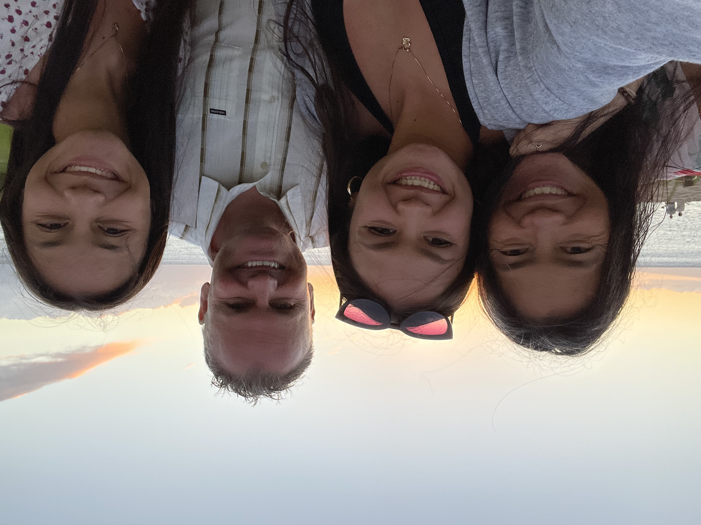

# Deena Pederson

### _About_
Deena Pederson was born and raised in Sunnyvale, California, by her parents Ted and Julie Pederson. She has a sister named Melody who currently attends UC Santa Barbra. She grew up loving school, as well as participating in sports and music. Deena is currently a 4th year Mathematics Computer Science Student at UC San Diego. She also competes on UCSD's Divison 1 softball team. If you wish to read more about Deena's time as a student athlete, check out her [Student Spotlight](https://physicalsciences.ucsd.edu/media-events/articles/2023/deena-pederson.html)

## **Family**

**What Deena's Family Has to Say About Her:**
>Deena has worked incredibly hard the past 4 years to accomplish her dreams of obtaining a degree in Mathematics Computer Science from UCSD while simultaneously playing softball at the Division 1 level. 

#### **Deena's First Code**
Deena took 3 coding courses throughout her high school years, which laid the foundation of her programming knowledge. Similar to many programmers, Deena's first code was 
```
System.out.println("Hello World");
```
in Java. From this point forward, she learned more and more [languages](#Coding-Languages). 


## **Sports**

### _Sports Participated In_
- Softball
- Track and Field
- Volleyball

### _Coding Languages Learned in Chronological Order_ 
1. Java
2. Python
3. R
4. Matlab
5. C
6. C++

### _Deena's Path to Becoming a Successful SWE_
- [x] be admitted to UCSD 
- [x] enroll in CSE 110
- [ ] successfully complete CSE 110
- [ ] graduate
- [ ] enter the workforce with new knowledge!